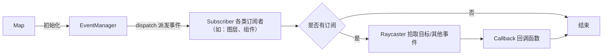
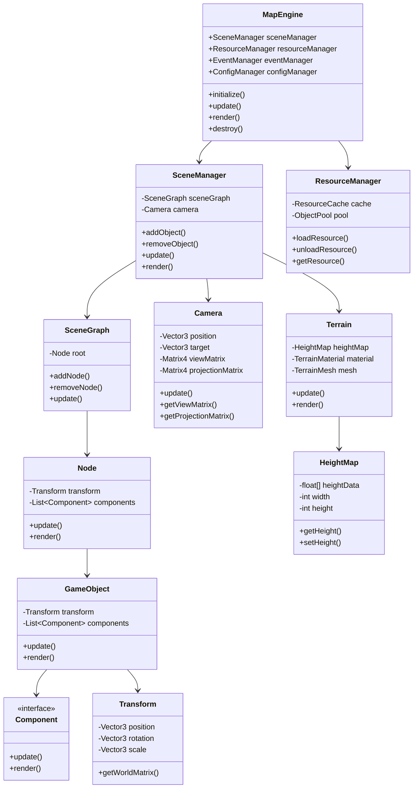

```mermaid
graph LR
    %% 核心引擎层
    Engine[游戏地图引擎] --> Core[核心系统]
    Engine --> Render[渲染系统]
    Engine --> Resource[资源系统]
    Engine --> Tool[工具系统]
    Engine --> Network[网络系统]

    %% 核心系统
    Core --> Scene[场景管理]
    Core --> Event[事件系统]
    Core --> Config[配置系统]
    Core --> Debug[调试系统]
    Core --> State[状态管理]

    %% 渲染系统
    Render --> Camera[相机系统]
    Render --> Terrain[地形系统]
    Render --> Object[物件系统]
    Render --> Effect[特效系统]
    Render --> UI[UI系统]
    Render --> PostProcess[后处理系统]

    %% 资源系统
    Resource --> Loader[资源加载器]
    Resource --> Cache[资源缓存]
    Resource --> Pool[对象池]
    Resource --> Asset[资产管理]

    %% 工具系统
    Tool --> Editor[地图编辑器]
    Tool --> Path[路径规划]
    Tool --> Export[地图导出]
    Tool --> Preview[预览系统]

    %% 网络系统
    Network --> Sync[状态同步]
    Network --> Replay[回放系统]
    Network --> Multiplayer[多人游戏]

    %% 场景管理
    Scene --> SceneGraph[场景图]
    Scene --> Culling[视锥体剔除]
    Scene --> LOD[LOD管理]
    Scene --> Partition[空间分区]

    %% 地形系统
    Terrain --> Grid[地形网格]
    Terrain --> Material[地形材质]
    Terrain --> Texture[地形纹理]
    Terrain --> HeightMap[高度图]
    Terrain --> Blend[地形混合]

    %% 物件系统
    Object --> Static[静态物件]
    Object --> Dynamic[动态物件]
    Object --> Collision[碰撞检测]
    Object --> Animation[动画系统]
    Object --> Physics[物理系统]

    %% 相机系统
    Camera --> Control[相机控制]
    Camera --> View[视口管理]
    Camera --> Transition[相机过渡]
    Camera --> Shake[相机震动]

    %% UI系统
    UI --> HUD[HUD系统]
    UI --> Window[窗口系统]
    UI --> Marker[标记系统]
    UI --> Minimap[小地图系统]

    %% 特效系统
    Effect --> Weather[天气系统]
    Effect --> Light[光照系统]
    Effect --> Particle[粒子系统]
    Effect --> Decal[贴花系统]

    %% 后处理系统
    PostProcess --> Bloom[泛光]
    PostProcess --> SSAO[环境光遮蔽]
    PostProcess --> DOF[景深]
    PostProcess --> Color[色彩校正]

    %% 样式定义
    classDef engine fill:#f9f,stroke:#333,stroke-width:2px
    classDef system fill:#bbf,stroke:#333,stroke-width:2px
    classDef component fill:#bfb,stroke:#333,stroke-width:2px

    class Engine engine
    class Core,Render,Resource,Tool,Network system
    class Scene,Terrain,Object,Camera,UI,Effect,PostProcess,Loader,Editor component
```

# 架构图

## 架构设计

## 架构说明

-   Map 是引擎的入口，管理调度引擎的各个子系统，持有引擎的上下文。
-   EventManager 事件系统，实现引擎的生命周期 hook。
-   Camera 相机组件，实现相机接口。
-   Renderer 渲染器组件，实现渲染器接口。
-   Scene 场景组件，实现场景接口。
-   ComponentManager 管理系统组件，管理各个组件的注册、注销、获取，组件用于扩展系统的能力，不应影响引擎的核心功能。

### 事件处理模型

-   事件系统通过 EventManager 管理，实现引擎的生命周期 hook。
-   事件注册到 container 上，通过 dispatch 在引擎内派发
-   事件派发时携带 event 和 context 上下文
-   实现 pickup 功能，传入事件坐标和其他判定条件，返回通过 Raycaster 检测到的对象

## 脑暴

### 系统架构图

### UML 类图

