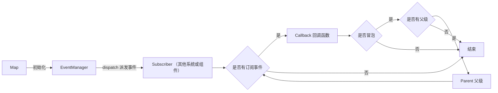
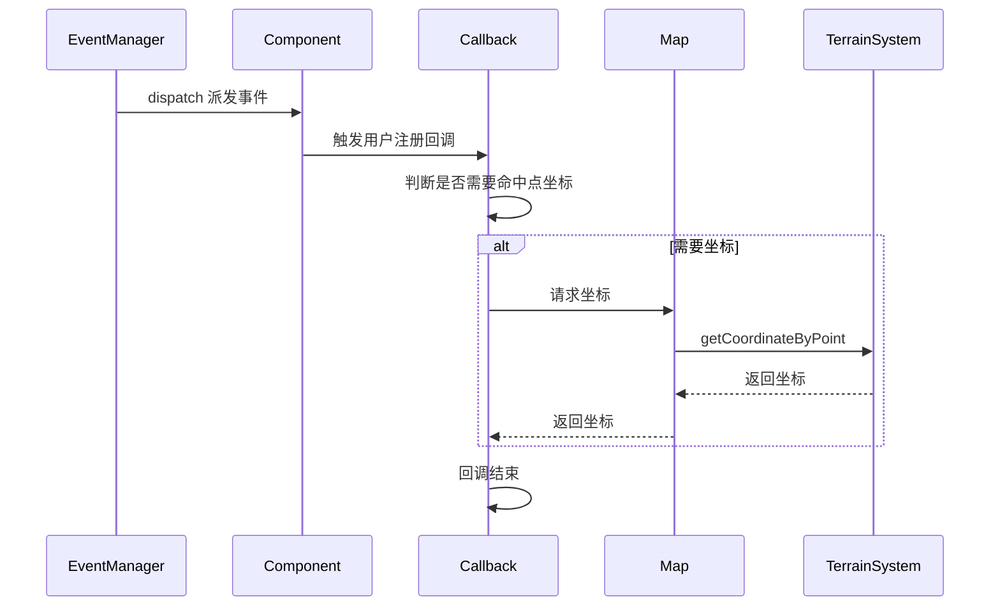

# 架构图

## 架构设计

```mermaid
classDiagram
    namespace Systems {
      class IMapContext
      class Map
      class IEventManager
      class EventManager
      class IRenderer
      class Renderer
      class ICamera
      class Camera
      class IComponentManager
      class ComponentManager
      class ISystemManager
      class SystemManager

      class IScene
      class Scene
    }

    namespace Components {
      class IComponent
      class Component
    }

    class IMapContext {
      引擎接口

      eventManager: IEventManager
      componentManager: IComponentManager
      renderer: IRenderer
      camera: ICamera
      scene: IScene
    }
    class Map {
      管理调度各个子系统

      init(context: IMapContext)
      update()
      render()
      destroy()
    }
    Map ..|> IMapContext
    Map ..> IComponentManager
    Map ..> IEventManager
    Map ..> IRenderer
    Map ..> ICamera
    Map ..> IScene



    class ISystemManager {
      系统管理器，管理各个系统

      register(System: ISystem) 注册系统
      unregister(System: ISystem) 注销系统
      getSystem(System: ISystem) 获取系统
    }
    ISystemManager ..> IMapContext

    class SystemManager {
      系统管理器，管理各个系统

      init(context: IMapContext)
    }
    SystemManager ..|> ISystemManager
    SystemManager ..> IMapContext
    SystemManager ..> ISystem

    class ISystem {
      系统接口，各个子系统需要实现这个接口

      init(context: IMapContext)
      update()
      render()
    }

    class IComponentManager {
      组件管理器，管理各个组件

      register(Component: IComponent) 注册组件
      unregister(Component: IComponent) 注销组件
      getComponent(Component: IComponent) 获取组件
    }

    class ComponentManager {
      组件管理器，管理各个组件

      register(Component: IComponent) 注册组件
      unregister(Component: IComponent) 注销组件
      getComponent(Component: IComponent) 获取组件
    }
    ComponentManager ..|> IComponentManager
    ComponentManager ..> IMapContext
    ComponentManager ..> IComponent

    class IComponent {
      组件接口，各个子组件需要实现这个接口

      init()
      update()
      render()
      destroy()
    }
    IComponent ..> IMapContext

    namespace Layers {
      class VectorLayer
    }

    class VectorLayer {
      矢量图层，用于管理矢量数据

      init(context: IMapContext)
      update()
      render()
    }
    VectorLayer ..|> IComponent
    VectorLayer ..> IVectorSource

    class ISource {
      数据源接口，用于获取管理数据

      getFeaturesByExtent(extent: Extent)
      getFeaturesByFilter(filter: Filter)
      getFeaturesByQuery(query: Query)
    }
    class VectorSource {
      矢量数据源，用于获取矢量数据

      init(context: IMapContext)
      update()
      render()
    }
    VectorSource ..|> ISource

    class IEventManager {
      事件系统，管理引擎的生命周期 hook

      init(context: IMapContext)
      on(event: string, callback: Function) 注册事件
      off(event: string, callback: Function) 注销事件
      emit(event: string, data: any) 触发事件
    }
    IEventManager ..> IMapContext

    class ICamera {
      相机接口

      pitch: number
      roll: number
      zoom: number
      position: Vector3


      flyTo(position: Vector3)
      rotateTo(rotation: Vector3)
      zoomTo(zoom: number)
      update()
      render()
    }

    class Camera {
      相机组件

      init(context: IMapContext)
      update()
      render()
    }
    Camera ..|> ICamera
    Camera ..> IMapContext

    class IRenderer {
      渲染器接口

      render(scene: IScene)
    }

    class Renderer {
      渲染器组件

      init(context: IMapContext)
      render()
    }
    Renderer ..|> IRenderer
    Renderer ..> IMapContext

    class IScene {
      场景接口

      init(context: IMapContext)
      update()
    }
    IScene ..> IMapContext

    class Scene {
      场景组件

      init(context: IMapContext)
    }
    Scene ..|> IScene
    Scene ..> IMapContext

    class ICrs {
      参考坐标系接口，用于管理像素坐标系和世界坐标系之间的转换

      bounds: Bounds
      elevation: number
      center: Vector3
      scale: number


      project(position: Vector3)
      unproject(position: Vector3)
    }

```



## 架构说明

-   Map 是引擎的入口，管理调度引擎的各个子系统，持有引擎的上下文。
-   EventManager 事件系统，实现引擎的生命周期 hook。
-   Camera 相机组件，实现相机接口。
-   Renderer 渲染器组件，实现渲染器接口。
-   Scene 场景组件，实现场景接口。
-   ComponentManager 管理系统组件，管理各个组件的注册、注销、获取，组件用于扩展系统的能力，不应影响引擎的核心功能。

### 事件系统

-   是否支持冒泡？
-   基础的 dom 事件（如：click、mousemove）到高级的 map 事件（如：doubleclick、longpress），自主实现还是引入第三方库？

#### 事件处理模型

-   事件系统通过 EventManager 管理，实现引擎的生命周期 hook。
-   事件注册到 container 上，通过 dispatch 在引擎内派发
-   事件派发时携带 event 和 context 上下文
-   实现 pickup 功能，传入事件坐标和其他判定条件，返回通过 Raycaster 检测到的对象
-   地形系统中实现屏幕坐标和世界坐标计算

#### 事件模型考虑兼容 dom 的事件模型

https://developer.mozilla.org/zh-CN/docs/Web/API/EventTarget

这样可以方便兼容 dom 的生态，且能够支持冒泡、捕获、阻止等功能

NOTE: 实现较复杂，现阶段先不考虑

#### EventManager 分发模型



#### 交互事件模型

大部分交互事件是需要命中点坐标的，因此需要借助 TerrainSystem 完成屏幕坐标到世界坐标的转换，因此这个交互模型分为两个阶段
第一阶段是 Map 捕获事件，通过 EventManager 派发事件，事件中携带屏幕坐标
第二阶段是用户主动调用 Map 的 getCoordinateByPoint(暂定接口) 获取命中点坐标，Map 负责调用 TerrainSystem 的接口完成坐标转换

这里的时序图为上文事件分发模型的一种具体场景，上问的订阅者在这里为具体的 Component



#### 生命周期模型

TODO: 考虑通过 tapable 库支持生命周期，以支持异步生命周期钩子

### 组件系统

TODO:
考虑使用类 ECS 系统，由 ComponentManager 管理组件，各系统/组件初始化后注册 filter 到 ComponentManager 中，组件加载时 ComponentManager 通过 filter 判断将组件分类管理。
背景问题：TerrainSystem 中需要获取所有地形组件，以判断鼠标事件命中的组件和坐标，如果组件直接注册到 TerrainSystem 中会产生耦合，TerrainSystem 需要知道所有地形组件类型，或者所有地形组件需要知道 TerrainSystem 的存在。
组件依赖系统在设计中是合理的，可以通过 context 获取所有注册的系统，但是系统依赖组件在设计中是不合理的，系统不应该关心组件的具体实现，可以通过 ITerrain 接口反转依赖。

```

</rewritten_file>
```
