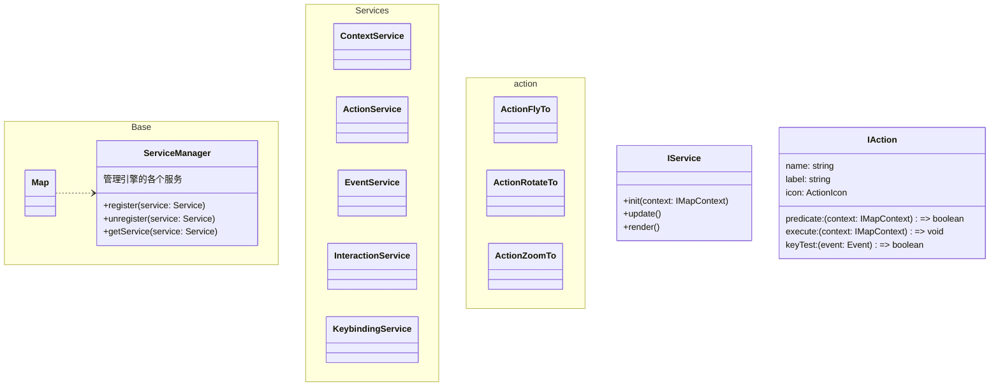
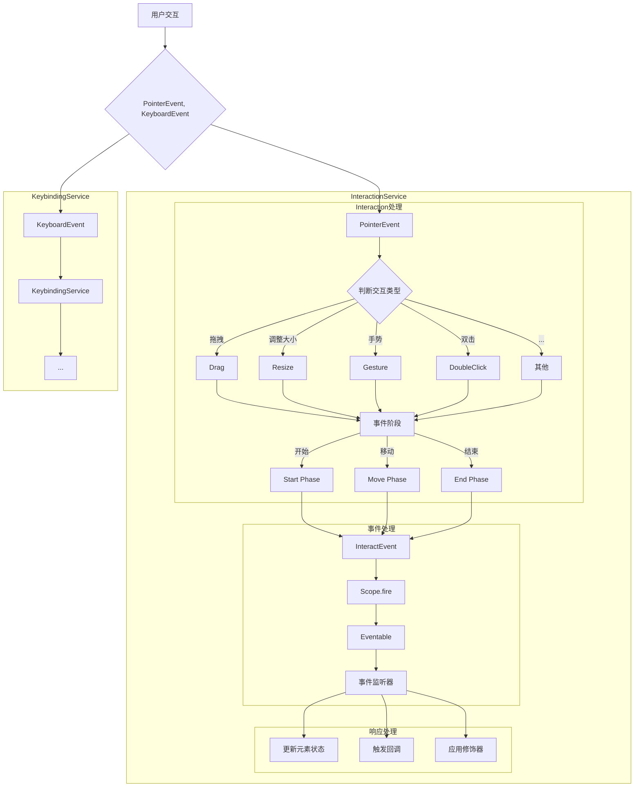

# 架构图

## 架构设计




## 架构说明

-   Map 是引擎的入口，管理调度引擎的各个子系统，持有引擎的上下文。
-   EventManager 事件系统，实现引擎的生命周期 hook。
-   Camera 相机组件，实现相机接口。
-   Renderer 渲染器组件，实现渲染器接口。
-   Scene 场景组件，实现场景接口。
-   ComponentManager 管理系统组件，管理各个组件的注册、注销、获取，组件用于扩展系统的能力，不应影响引擎的核心功能。

### 事件模型

#### 交互系统

基础事件系统负责捕获交互事件，并归一化为引擎事件对象（如 PointerEvent）

归一化的交互事件对象分为两类：

- 指针事件 PointerEvent
- 键盘事件 KeyboardEvent

对于指针事件归一化后将 PointerEvent 派发到 InteractionService 进行复杂交互的处理，如拖拽、双击、手势等。  
对于键盘事件归一化后将 KeyboardEvent 派发到 KeybindingService 进行快捷键的处理。(TODO: 未实现)

**事件系统流程图**



#### 事件系统

**生命周期模型**

TODO: 考虑通过 tapable 库支持生命周期，以支持异步生命周期钩子

**发布订阅模型**

TODO: 待完善

-   事件系统通过 EventManager 管理，实现引擎的生命周期 hook。
-   事件注册到 container 上，通过 dispatch 在引擎内派发
-   事件派发时携带 event 和 context 上下文
-   实现 pickup 功能，传入事件坐标和其他判定条件，返回通过 Raycaster 检测到的对象
-   地形系统中实现屏幕坐标和世界坐标计算

### 投影系统

Map 通过 CRS 系统管理投影，实现世界坐标和像素坐标之间的转换。

CRS 由两部分组成：

-   projection 用于表达非线性投影算法，如墨卡托投影、高斯克吕格投影等
-   transform 用于表达线性坐标系转换，如经纬度坐标系和像素坐标系之间的转换

CRS 系统通过 projection 和 transform 实现世界坐标和像素坐标之间的转换。

分解为 projection 和 transform 两部分可以灵活的组合投影算法和坐标系转换。  

如：EPSG:4326 和 上海 2000 都是墨卡托投影计算，但是上海 2000 将地图原点设置在了上海，而 EPSG:4326 将地图原点设置在了赤道。只需要通过使用不同的 transform 进行平移即可实现这两个不同的坐标系。

### 组件系统

TODO:
考虑使用类 ECS 系统，由 ComponentManager 管理组件，各系统/组件初始化后注册 filter 到 ComponentManager 中，组件加载时 ComponentManager 通过 filter 判断将组件分类管理。
背景问题：TerrainSystem 中需要获取所有地形组件，以判断鼠标事件命中的组件和坐标，如果组件直接注册到 TerrainSystem 中会产生耦合，TerrainSystem 需要知道所有地形组件类型，或者所有地形组件需要知道 TerrainSystem 的存在。
组件依赖系统在设计中是合理的，可以通过 context 获取所有注册的系统，但是系统依赖组件在设计中是不合理的，系统不应该关心组件的具体实现，可以通过 ITerrain 接口反转依赖。

```

</rewritten_file>
```
