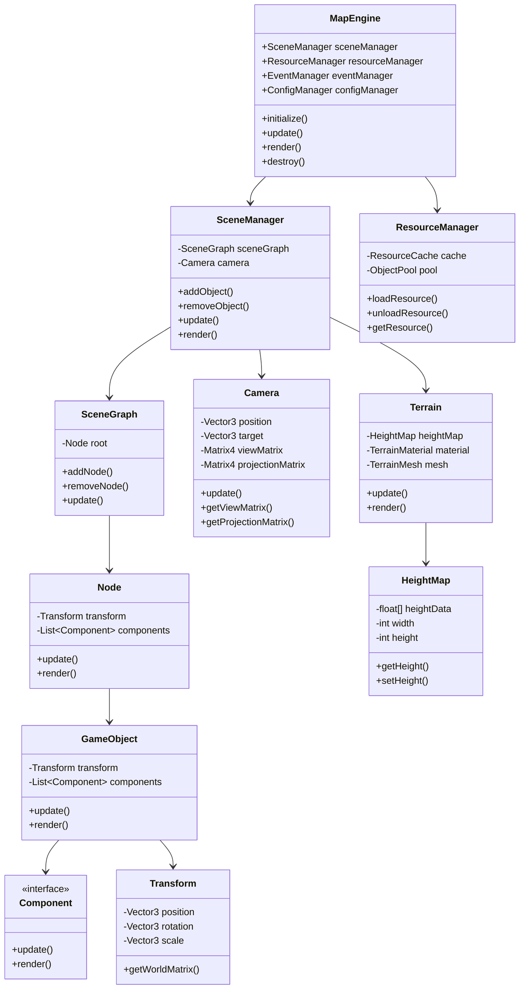

# 架构图

## 系统架构图

```mermaid
graph LR
    %% 核心引擎层
    Engine[游戏地图引擎] --> Core[核心系统]
    Engine --> Render[渲染系统]
    Engine --> Resource[资源系统]
    Engine --> Tool[工具系统]
    Engine --> Network[网络系统]

    %% 核心系统
    Core --> Scene[场景管理]
    Core --> Event[事件系统]
    Core --> Config[配置系统]
    Core --> Debug[调试系统]
    Core --> State[状态管理]

    %% 渲染系统
    Render --> Camera[相机系统]
    Render --> Terrain[地形系统]
    Render --> Object[物件系统]
    Render --> Effect[特效系统]
    Render --> UI[UI系统]
    Render --> PostProcess[后处理系统]

    %% 资源系统
    Resource --> Loader[资源加载器]
    Resource --> Cache[资源缓存]
    Resource --> Pool[对象池]
    Resource --> Asset[资产管理]

    %% 工具系统
    Tool --> Editor[地图编辑器]
    Tool --> Path[路径规划]
    Tool --> Export[地图导出]
    Tool --> Preview[预览系统]

    %% 网络系统
    Network --> Sync[状态同步]
    Network --> Replay[回放系统]
    Network --> Multiplayer[多人游戏]

    %% 场景管理
    Scene --> SceneGraph[场景图]
    Scene --> Culling[视锥体剔除]
    Scene --> LOD[LOD管理]
    Scene --> Partition[空间分区]

    %% 地形系统
    Terrain --> Grid[地形网格]
    Terrain --> Material[地形材质]
    Terrain --> Texture[地形纹理]
    Terrain --> HeightMap[高度图]
    Terrain --> Blend[地形混合]

    %% 物件系统
    Object --> Static[静态物件]
    Object --> Dynamic[动态物件]
    Object --> Collision[碰撞检测]
    Object --> Animation[动画系统]
    Object --> Physics[物理系统]

    %% 相机系统
    Camera --> Control[相机控制]
    Camera --> View[视口管理]
    Camera --> Transition[相机过渡]
    Camera --> Shake[相机震动]

    %% UI系统
    UI --> HUD[HUD系统]
    UI --> Window[窗口系统]
    UI --> Marker[标记系统]
    UI --> Minimap[小地图系统]

    %% 特效系统
    Effect --> Weather[天气系统]
    Effect --> Light[光照系统]
    Effect --> Particle[粒子系统]
    Effect --> Decal[贴花系统]

    %% 后处理系统
    PostProcess --> Bloom[泛光]
    PostProcess --> SSAO[环境光遮蔽]
    PostProcess --> DOF[景深]
    PostProcess --> Color[色彩校正]

    %% 样式定义
    classDef engine fill:#f9f,stroke:#333,stroke-width:2px
    classDef system fill:#bbf,stroke:#333,stroke-width:2px
    classDef component fill:#bfb,stroke:#333,stroke-width:2px

    class Engine engine
    class Core,Render,Resource,Tool,Network system
    class Scene,Terrain,Object,Camera,UI,Effect,PostProcess,Loader,Editor component
```



## UML 类图



## 关键组件说明

### 1. 核心系统

- **场景管理**：负责场景的创建、更新和渲染
- **事件系统**：处理游戏中的各种事件
- **配置系统**：管理引擎配置和地图配置
- **调试系统**：提供调试工具和性能监控
- **状态管理**：管理游戏状态和场景状态

### 2. 渲染系统

- **相机系统**：处理视角控制和相机效果
- **地形系统**：管理地形渲染和编辑
- **物件系统**：处理游戏物件的渲染和交互
- **特效系统**：处理各种视觉效果
- **后处理系统**：处理屏幕空间效果

### 3. 资源系统

- **资源加载器**：负责加载各种资源
- **资源缓存**：管理已加载的资源
- **对象池**：优化对象创建和销毁
- **资产管理**：管理资源依赖关系

### 4. 工具系统

- **地图编辑器**：提供地图编辑功能
- **路径规划**：处理寻路和路径生成
- **预览系统**：提供实时预览功能

### 5. 网络系统

- **状态同步**：处理多人游戏状态同步
- **回放系统**：支持游戏回放功能
- **多人游戏**：处理多人游戏逻辑

````mermaid
graph TD
    subgraph Core[核心管理层]
        A[Core Manager] --> B[ECS Core]
        B --> B1[Entity Manager]
        B --> B2[Component Pool]
        B --> B3[System Scheduler]
        A --> C[Scene Graph]
        C --> C1[Layer Manager]
        C --> C2[Coordinate Transformer]
    end

    subgraph ECS[ECS模块]
        D[Entity] --> D1[UUID]
        E[Component] --> E1[TransformComponent]
        E --> E2[TileComponent]
        E --> E3[MeshComponent]
        F[System] --> F1[RenderingSystem]
        F --> F2[AnimationSystem]
        F --> F3[PhysicsSystem]
    end

    subgraph ThreeJS[Three.js渲染模块]
        G[Three.js Renderer] --> G1[Scene]
        G --> G2[Camera Controller]
        G --> G3[InstancedMesh Pool]
        G --> G4[Material Manager]
        G --> G5[Shader Processor]
    end

    subgraph Interaction[交互系统]
        H[Input Handler] --> H1[Raycaster]
        H --> H2[Event Dispatcher]
        H --> H3[Tool Proxy]
    end

    subgraph Tools[工具插件]
        I[Plugin Interface] --> I1[Measure Tool]
        I --> I2[Path Planner]
        I --> I3[Weather Simulator]
    end

    subgraph Perf[性能模块]
        J[Frame Controller] --> J1[FPS Optimizer]
        J --> J2[Memory Monitor]
        J --> J3[LOD Manager]
    end

    Core -->|调度| ThreeJS
    ECS -->|数据驱动| ThreeJS
    ThreeJS -->|渲染输出| Canvas
    Interaction -->|事件传递| Core
    Tools -->|扩展功能| Interaction
    Perf -->|优化参数| Core
    ```
````
